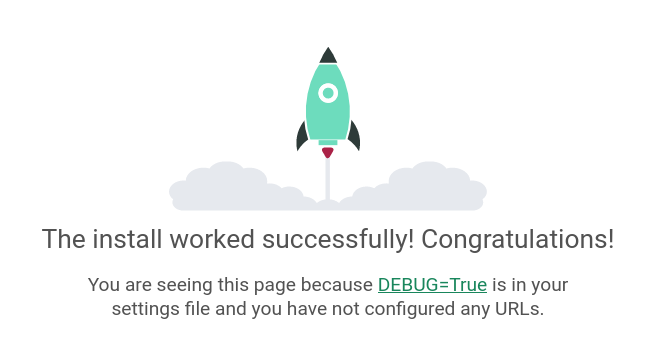

## Создание проекта

Находимся в директории `website`.

Инициализация проекта:
```
(django_env)$ django-admin startproject storedvd ./
```
Добавляем заготовку приложения `shop`:
```
(django_env)$ django-admin startapp shop
```

Структура проекта:
```
website/
├── storedvd
│   ├── __init__.py
│   ├── asgi.py
│   ├── settings.py
│   ├── urls.py
│   └── wsgi.py
├── shop
│   ├── migrations
│   │   └── __init__.py
│   ├── __init__.py
│   ├── admin.py
│   ├── apps.py
│   ├── models.py
│   ├── tests.py
│   └── views.py
└── manage.py
```

Запускаем сервер на localhost'e:
```
python manage.py runserver
```

Убеждаемся, что все работает, открыв нужный адрес в веб-браузере (например, Firefox):
```
firefox http://127.0.0.1:8000/
```



