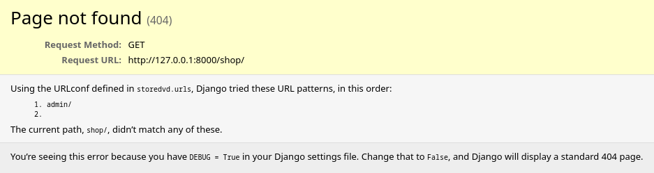

## Первичные изменения в шаблоне

### Настройки проекта

Файл `storedvd/settings.py`


Адреса хостов, которые будут обработаны
```
ALLOWED_HOSTS = ['127.0.0.1', 'storedvd.ru', 'www.storedvd.ru']
```


Добавляем в список установленных приложений созданное ранее `shop`:
```
installed_apps = [
    ...
    'shop.apps.ShopConfig',
]
```
Строчка означает, что импортируется класс `ShopConfig` модуля `apps`, расположенного в директории приложения `shop`.


Путь к главному маршрутизатору (запускается самым первым):
```
ROOT_URLCONF = 'storedvd.urls'
```


Локализация и форматирование:
- сайт на русском, поэтому изменили локализацию по умолчанию `LANGUAGE_CODE = 'ru-ru'`;
- `USE_I18N = True` активирует использование заданной локализации `ru-ru`;
- `USE_L10N = True` форматирует дату-время в соответствии с локализацией;
- `TIME_ZONE = 'Europe/Moscow'`;
- `USE_TZ = True` приводить входящие метки времени к значениям выбранной зоны.

---

Файл `storedvd/urls.py`


Начинаем добавлять правила маршрутизации. По-простому, мы перечисляем, для какого URL будет вызвана определенная функция (View). Добавляем правила для главной страницы магазина:
1) `www.storedvd/shop`:
    - `path('shop/', include('shop.urls'))`;
    - не забываем импортировать модуль include `from django.urls import path, include`;
    - создаем заготовку модуля `shop/urls.py` с пустым списком `urlpatterns`;
2) редирект с корневого адреса (`ROOT_URLCONF`) на `www.storedvd/shop`
    - `path('', RedirectView.as_view(url='shop/', permanent=True))`;
    - импортируем нужные модули `from django.views.generic import RedirectView`;

После внесенных изменений получаем редирект с адреса `127.0.0.1:8000` на `127.0.0.1:8000/shop/` c ожидаемым кодом 404:

